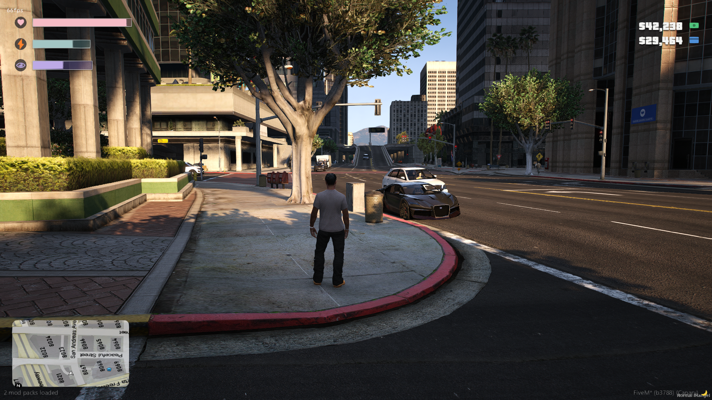
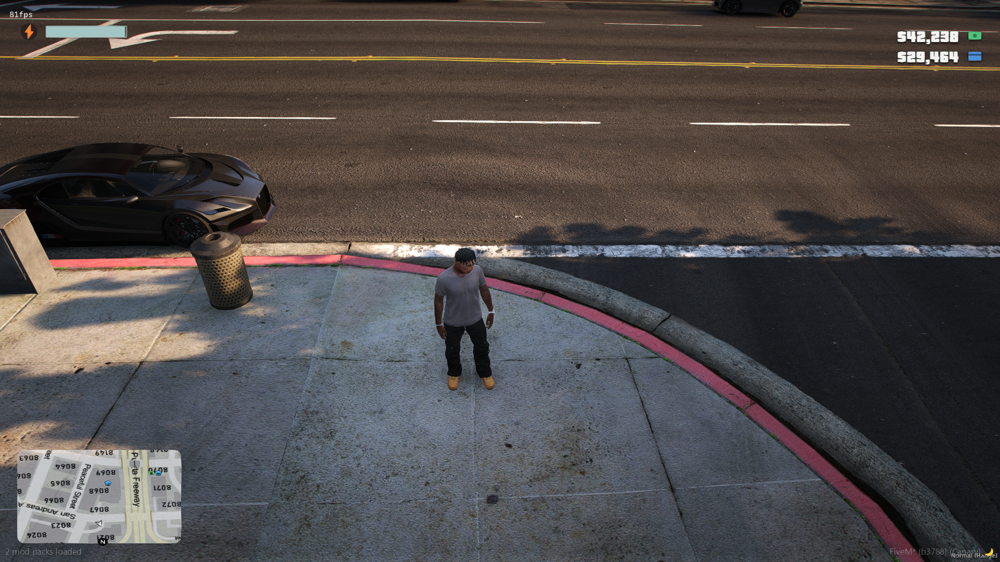
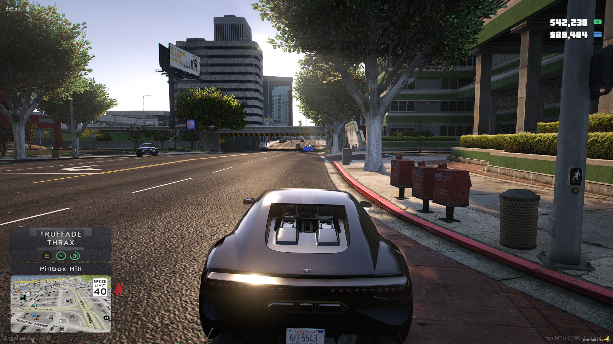
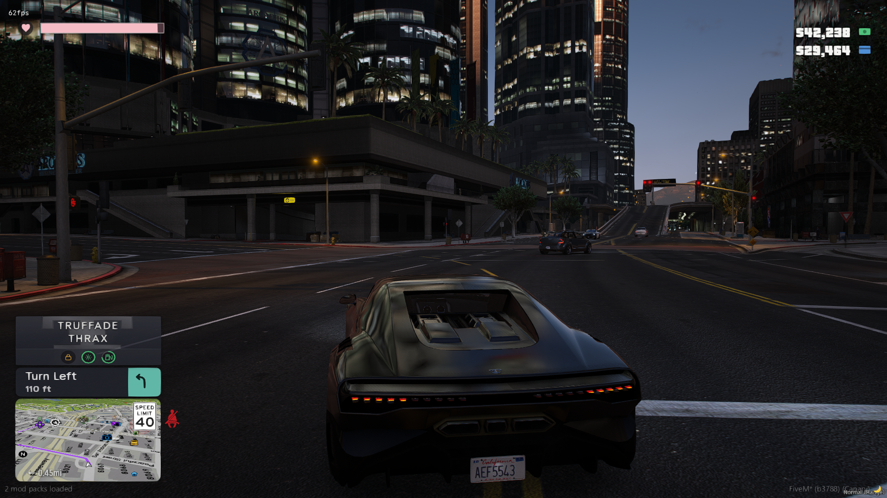
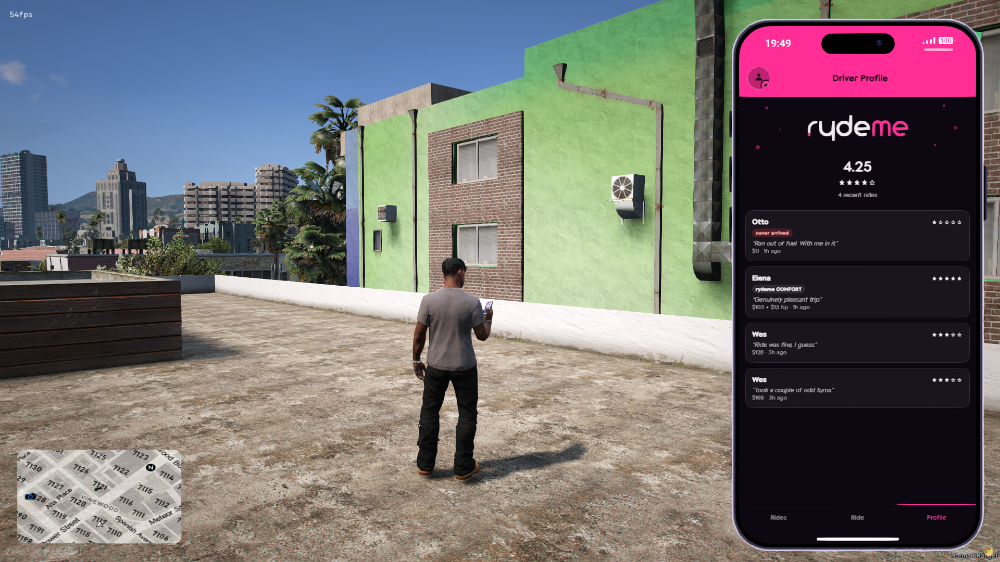
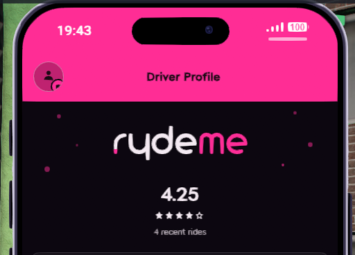
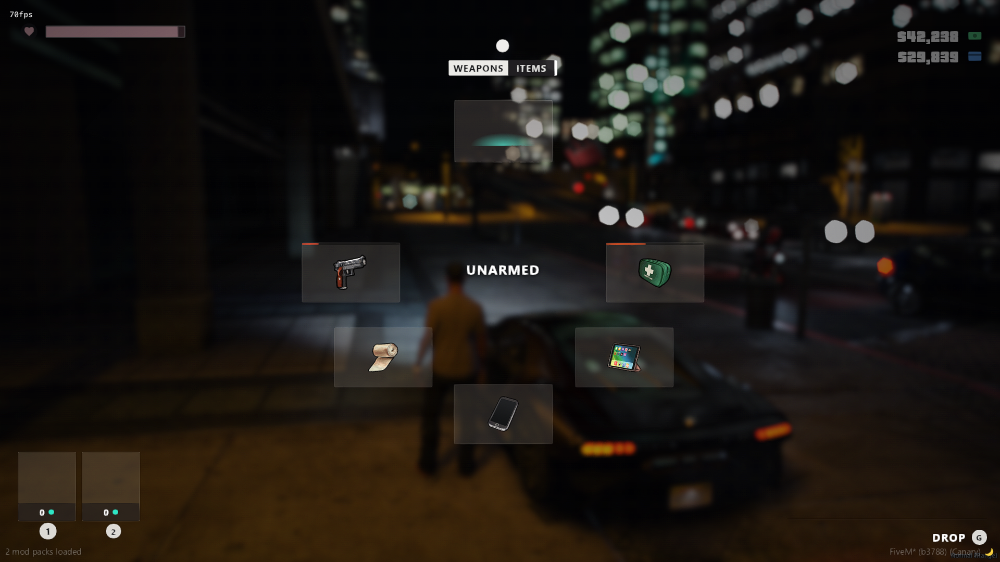

# GTA VI Resources

A bundle of FiveM/Qbox resources built around a GTA VI (Vice City / Leonida)
visual identity — a shared HUD, a matching popup/menu theme spread across a
few community resources, a gig-economy phone app pair, and a reskinned
inventory screen — organized as a standalone, installable package.

Visual direction throughout this set — the HUD layout, the neon/Art Deco
color language, the general "leaked GTA VI trailer" feel — was inspired by
CyberLeek's videos.

> [!NOTE]
> **Work in progress.** This is built and tuned against one live server, not
> a general-purpose release — some things may not work correctly on a
> different setup, and configs/paths may assume pieces of that server that
> aren't documented here yet. If something's broken or missing for you,
> please [open an issue](../../issues) or send a
> [pull request](../../pulls) rather than assuming it's intentional.

## Screenshots

| | |
| --- | --- |
|  |  |
| Health / stamina / oxygen bars | Stamina + oxygen, anti-flicker auto-hide |
|  |  |
| Vehicle panel, minimap, speed limit sign (day) | Vehicle panel + turn-by-turn (night) |
|  |  |
| `um_gigs` — Ryde Me driver profile | Driver profile, close up |
|  | |
| `ox_inventory` — GTA6 weapon wheel hotbar | |

## What's in here

```
GTA VI Resources/
├── resources/     Full, self-contained resources. Drag any of these
│                  straight into your server's resources/ folder.
│
├── patches/       NOT standalone resources. Small overlay files that connect
│                  vice_hud to resources you install separately (ox_lib,
│                  ox_target, ox_inventory, qb-menu, qb-input, speedlimits,
│                  zseatbelt, um_smallresources).
│                  See docs/PATCHES.md for exact install steps per resource.
│
└── docs/          Extra documentation, including the patch install guide.
```

Everything under `resources/` is a complete, ready-to-run resource on its
own. Everything under `patches/` is deliberately **not** a full copy of the
resource it touches — those are large, independently-useful community
resources that aren't "GTA VI resources" in themselves. Only the handful of
files that were changed or added to connect each one to vice_hud are
included here.

### `resources/`

- **`vice_hud`** — The core HUD: minimap, vehicle panel, zone bar, skills,
  stamina/oxygen, notifications, a full in-game HUD editor (`/hudedit`), and
  the theme engine (`/hudtheme`, `/themepublish`) that the `patches/` folder
  plugs into. Has its own `README.md` and `docs/INTERNALS.md` inside —
  start there for anything HUD-specific. Depends on `ox_lib`.

- **`um_gigs`** — "Snarf" and "Ryde Me": two
  parody gig-economy phone apps served through `lb-phone`, styled with the
  same Art Deco / Vice aesthetic as the rest of this set. Depends on
  `ox_lib`, `ox_target`, `qbx_core`, `lb-phone`.

- **`qbx_honor`** — An RDR2-style persistent honor stat, purpose-built to
  draw its devil/angel toast and centre-screen indicator on vice_hud's NUI
  (see its own `README.md`'s "vice_hud" section). Small and self-contained
  enough to ship whole rather than as a patch. Depends on `qbx_core`,
  `ox_target`.

### `patches/`

Overlays for resources you install separately:

- **`ox_lib`** — the popup/notification glass theme (`lib.notify`, context
  menus, dialogs, progress bars).
- **`ox_target`**, **`qb-menu`**, **`qb-input`** — each has its own
  `ui_page`, so each needed its own small copy of the same theme hook.
- **`ox_inventory`** — a separate, unrelated GTA6-inspired reskin of the F2
  inventory screen and the in-world hotbar: an 8-cell role-based weapon wheel
  (free/melee/handheld/fist), medical-only quickslots, and a `qbx_honor`
  standing badge, [screenshot](docs/screenshots/ox_inventory-weapon-wheel.png)
  — not part of the vice_hud glass system above.
- **`speedlimits`**, **`zseatbelt`** — positioning hooks, so vice_hud's
  `/movehud` editor can move each one's on-screen icon even though both
  draw through their own NUI page.
- **`um_smallresources`** — not theming: a functional fix for a stamina
  script in this pack that conflicts with vice_hud's stamina bar.

**Read [`docs/PATCHES.md`](docs/PATCHES.md) before touching any of these** —
each one needs a couple of files copied into an existing install plus, for
most, a one- or two-line manifest/HTML edit. None of it is drag-and-drop on
its own.

## Installing (drag-and-drop resources)

1. Copy `resources/vice_hud`, `resources/um_gigs`, and/or `resources/qbx_honor`
   into your server's `resources/` folder.
2. Add them to `server.cfg`:
   ```
   ensure vice_hud
   ensure um_gigs
   ensure qbx_honor
   ```
3. Make sure the dependencies each one needs are already installed and
   started *before* it in `server.cfg`:
   - `vice_hud` needs **ox_lib**.
   - `um_gigs` needs **ox_lib**, **ox_target**, **qbx_core**, **lb-phone**.
   - `qbx_honor` needs **qbx_core**, **ox_target**.
4. Restart the resource (or the server) and confirm it starts clean in the
   server console.

`vice_hud` ships its own `README.md` with the full command list
(`/hudedit`, `/hudreset`, `/hudtheme`, `/themepublish`, etc.) — read that
once it's installed.

## Installing (theme patches)

These are not resources — do not `ensure` a `patches/` folder. Follow
[`docs/PATCHES.md`](docs/PATCHES.md), which walks through each of `ox_lib`,
`ox_target`, `ox_inventory`, `qb-menu`, `qb-input`, `speedlimits`,
`zseatbelt`, and `um_smallresources` individually: which files to copy in,
and the exact manifest/HTML edits (where one is needed).

An update to any of those patched resources will silently wipe its patch —
that's expected, and `PATCHES.md` says so per-resource. Re-apply after
updating.

## Recommended pairings

Not bundled here — separate projects you install yourself, credited rather
than embedded because neither publishes a license covering redistribution:

- **[FlyBanditMods-iOS_LS_Map-Lite](https://github.com/TheFlyBandit/FlyBanditMods-iOS_LS_Map-Lite)**
  by TheFlyBandit — an iOS/Google-Maps-styled minimap texture replacement.
  Drag-and-drop per its own README; `vice_hud`'s rounded minimap mask and
  wanted-search overlay sit on top of whatever map style is loaded, so the
  two work together with no extra configuration. Grab it from the link
  above rather than from a copy in this repo.

## The arista-pro font

`resources/um_gigs/ui/fonts/arista-pro.pro-trial-regular.ttf` is bundled and
registered via `@font-face` in `ui/app.css` under the family name
`'Arista Pro'`, and listed in `fxmanifest.lua`'s `files{}` so FiveM actually
ships it to clients. Neither app currently points `--font-body` at it —
Ryde Me still uses GTAArtDeco, Snarf still uses the system font stack — the
font is just present and ready to use if you want to switch either app's
`--font-body` to `'Arista Pro'`.

## License

This repository is licensed under the [GNU General Public License v3.0](LICENSE),
matching `vice_hud`, its core resource.

`resources/vice_hud` carries its own `LICENSE` file (also GPL-3.0) — that
governs that folder specifically. Nothing else under `resources/` or
`patches/` ships its own `LICENSE` here, since `patches/` is only a handful
of individual files extracted from each project, not a full copy — but the
original projects remain under their own upstream license:

| Project | License |
| --- | --- |
| `ox_lib` | LGPL-3.0 |
| `ox_target` | MIT |
| `ox_inventory` | GPL-3.0 |
| `qb-menu`, `qb-input` | GPL-3.0 |
| `speedlimits`, `zseatbelt` | MIT |
| `um_smallresources` | GPL-3.0 |

Check each project's own repository for its full license text before
redistributing patched files from this bundle outside your own server.

## Contributing

If you edit any part of this source, please make your fork available on
GitHub so we can all work together on it. Since this is still a work in
progress (see the note up top), bug reports and pull requests are both
welcome — [open an issue](../../issues) if something doesn't work, or
[send a PR](../../pulls) if you've already fixed it.

## Notes

- Version numbers noted in `docs/PATCHES.md` are what each patch was built
  and tested against.
- `resources/vice_hud` carries its own `.gitignore` (excludes
  `node_modules/`, its Python asset-prep tooling's `__pycache__/`, and raw
  pre-conversion texture originals) — respect it if you resync it from your
  own server later rather than flattening everything in.
