# GTA VI Resources

A bundle of FiveM/Qbox resources built around a GTA VI (Vice City / Leonida)
visual identity: a shared HUD, a matching popup/menu theme spread across a
few community resources, a gig-economy phone app pair, and a reskinned
inventory screen, organized as a standalone, installable package.

Visual direction throughout this set (the HUD layout, the neon/Art Deco
color language, the general "leaked GTA VI trailer" feel) was inspired by
CyberLeek's videos and GTA VI Extended Look.

> [!NOTE]
> **Work in progress.** This is built and tuned against one live server, not
> a general-purpose release, so some things may not work correctly on a
> different setup, and configs/paths may assume pieces of that server that
> aren't documented here yet. If something's broken or missing for you,
> please [open an issue](../../issues) or send a
> [pull request](../../pulls) rather than assuming it's intentional.

> [!TEST SERVER]
> **Want to see it running before you install anything?** This is the HUD
> and UI set up for Upstate Mafia: [cfx.re/join/v6pzj5](https://cfx.re/join/v6pzj5).

## Screenshots

| | |
| --- | --- |
| 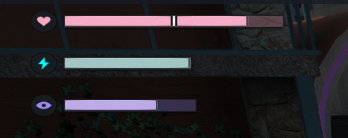 | 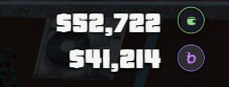 |
| Health / stamina / oxygen bars | Cash / bank close-up |
| 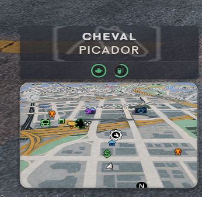 | 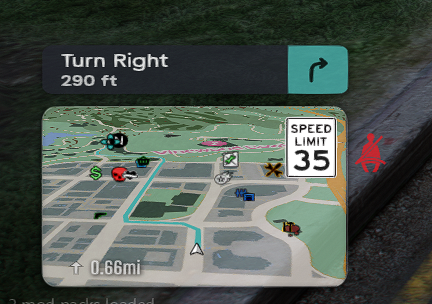 |
| Vehicle panel + minimap, on approach | Turn-by-turn + speed limit sign (Male) |
| 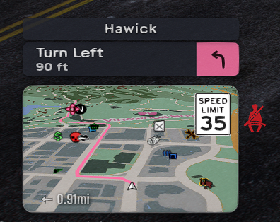 | 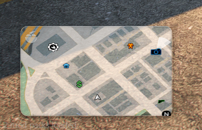 |
| Turn-by-turn + speed limit sign (Female) | Minimap with the outline frame and map badge on |
| 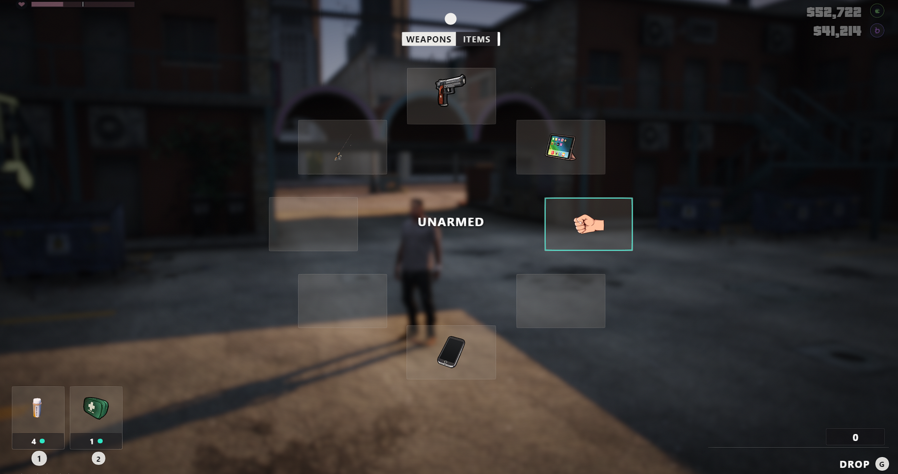 | 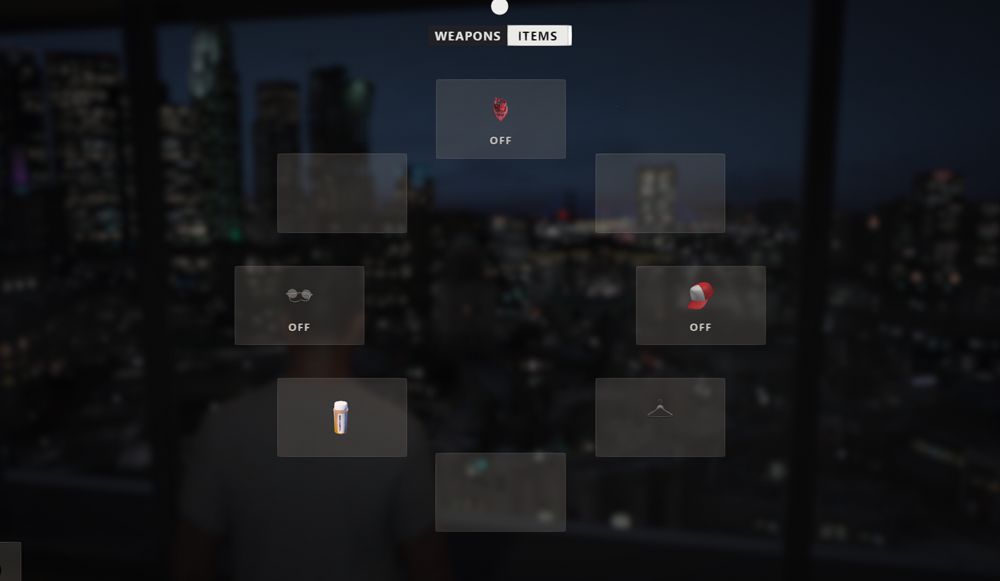 |
| `ox_inventory`: GTA6 weapon wheel hotbar | Items wheel, with the mask/eyewear/hat toggles |
| 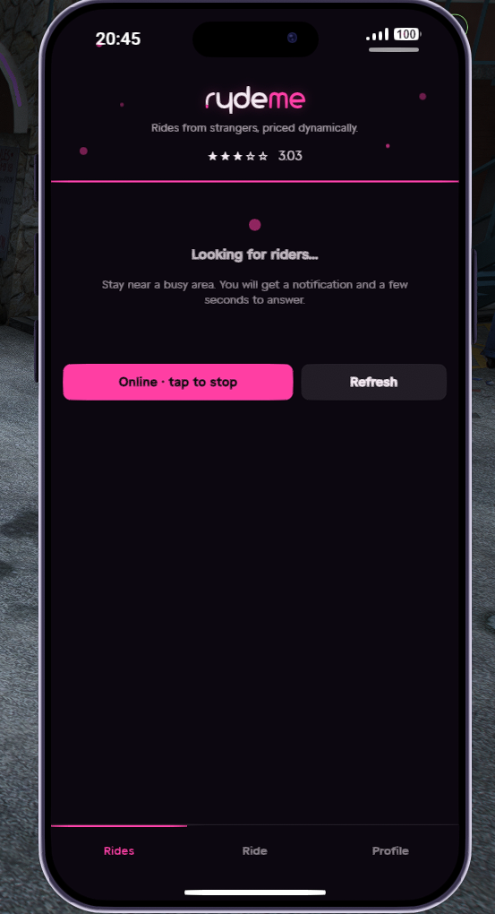 | 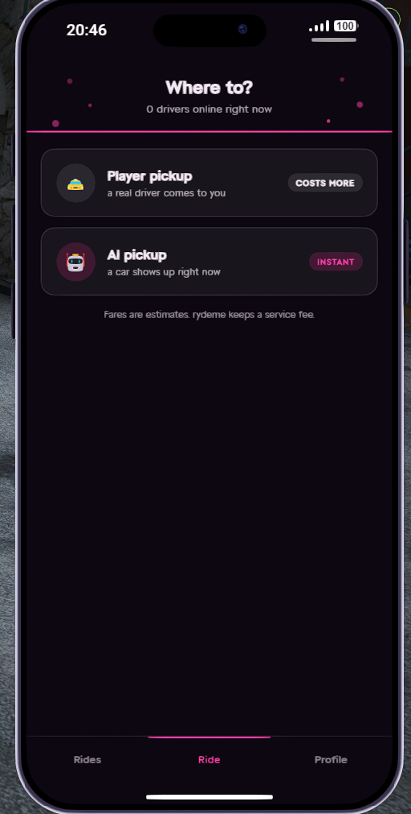 |
| `um_gigs`, Ryde Me driver app, online | Rider app, requesting a ride |
| 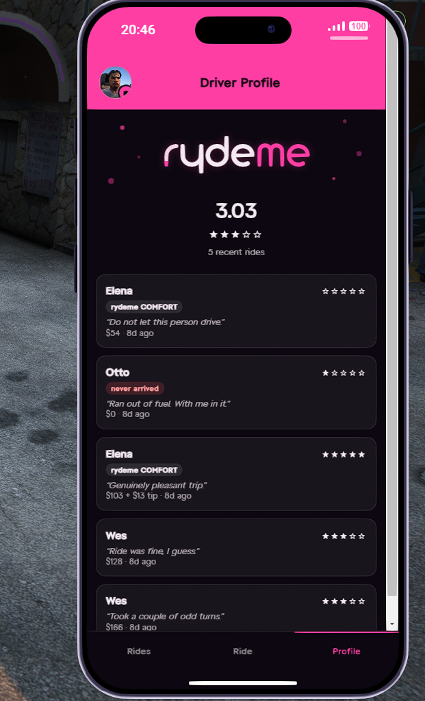 | 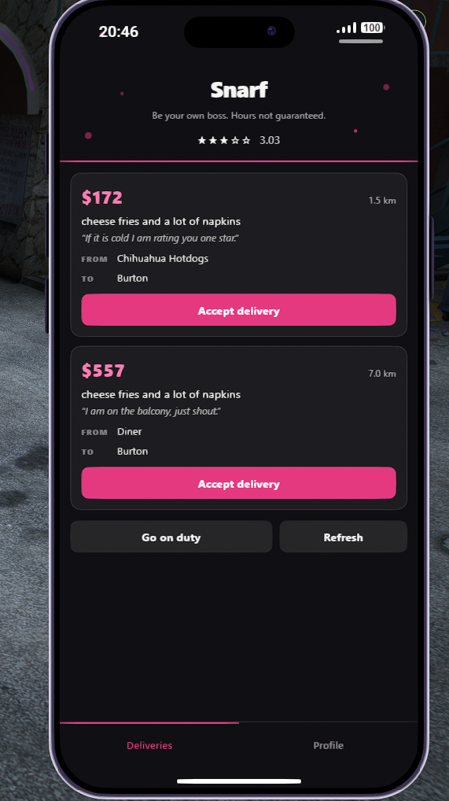 |
| Driver profile / ride history | `um_gigs`, Snarf delivery board |
| 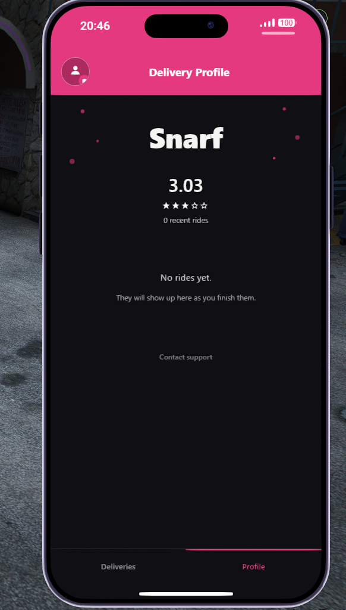 | 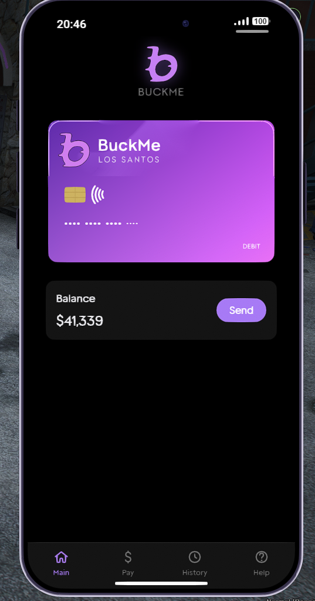 |
| Delivery profile | `lb-phone` BuckMe card, front |
| 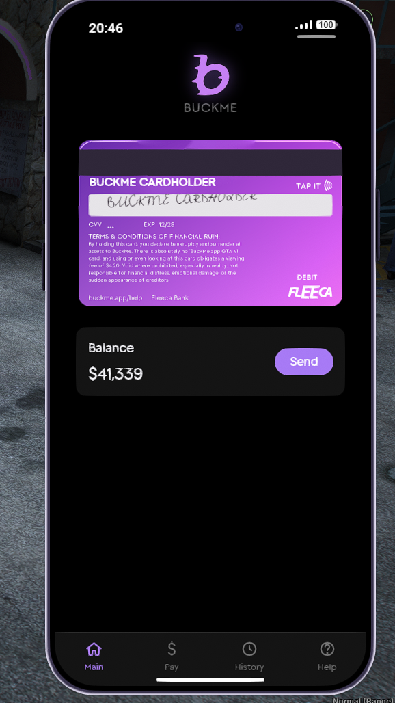 | 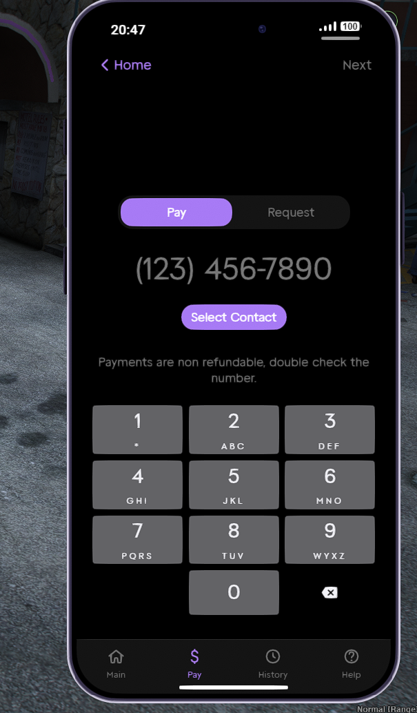 |
| BuckMe card, back | Pay a contact |
| 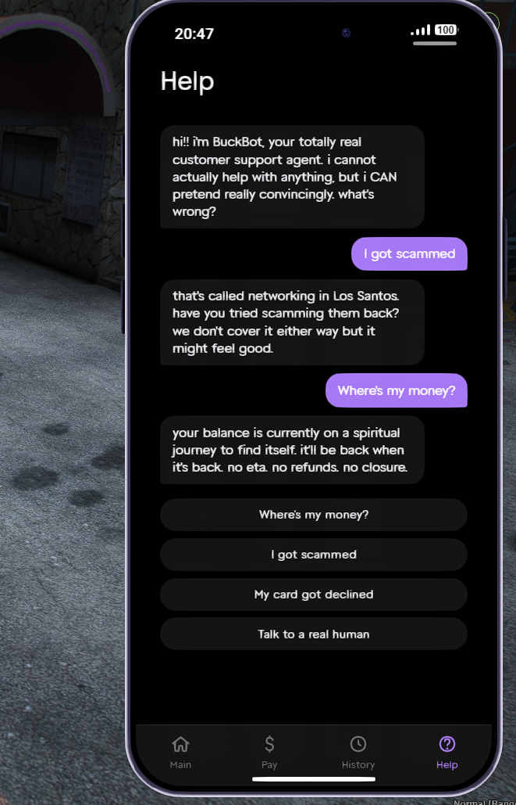 | 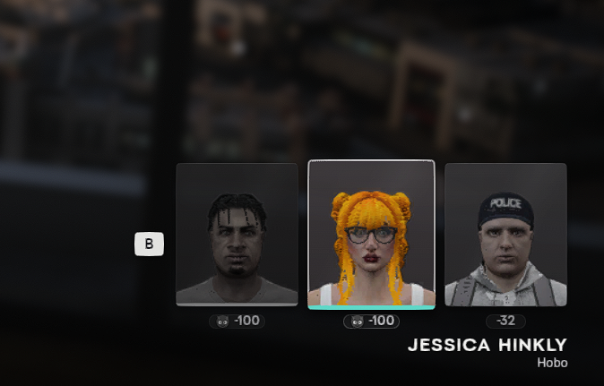 |
| BuckBot support chat | `qbx_relog`: hold-to-switch character strip |
| 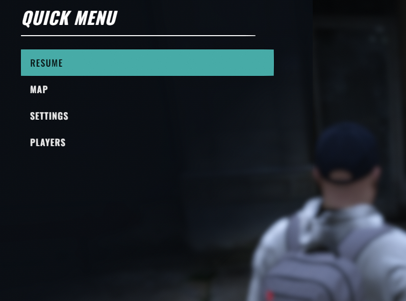 | 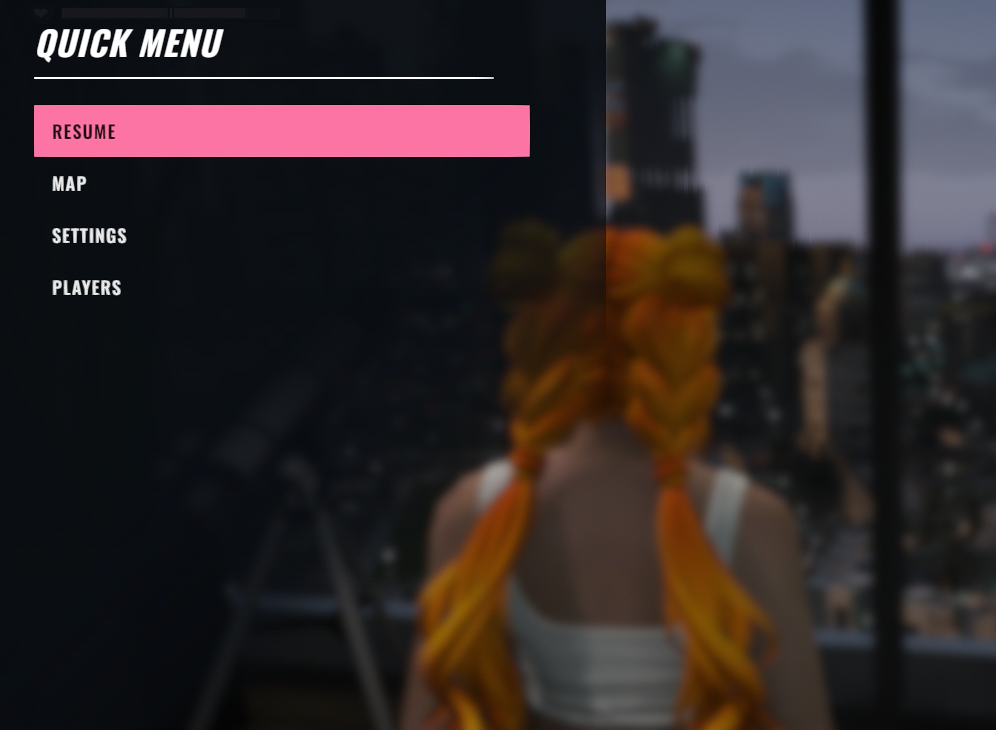 |
| `gk_pausemenu`: quick menu, male accent colour | Quick menu, female accent colour |
| 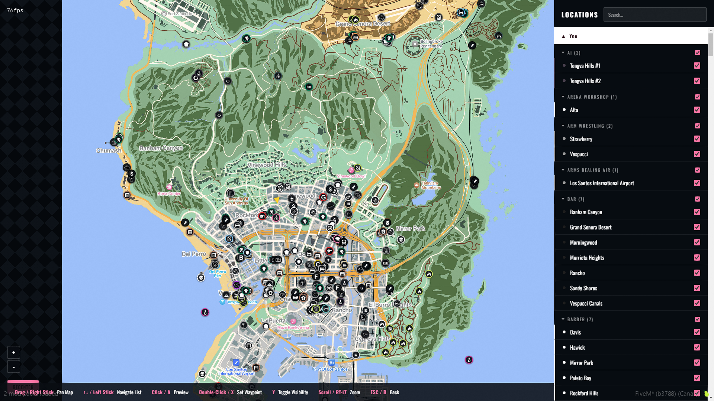 | |
| `gk_pausemenu`: Map tab with the Locations panel | |

## What's in here

```
GTA VI Resources/
├── resources/     Full, self-contained resources. Drag any of these
│                  straight into your server's resources/ folder.
│
├── patches/       NOT standalone resources. Small overlay files that connect
│                  vice_hud to resources you install separately (ox_lib,
│                  ox_target, ox_inventory, qb-menu, qb-input, speedlimits,
│                  zseatbelt, um_smallresources, um_clothing, qbx_core), plus
│                  a standalone lb-phone Wallet app rebrand that doesn't touch
│                  vice_hud at all. See docs/PATCHES.md for exact install
│                  steps per resource.
│
└── docs/          Extra documentation, including the patch install guide.
```

Everything under `resources/` is a complete, ready-to-run resource on its
own. Everything under `patches/` is deliberately **not** a full copy of the
resource it touches. Those are large, independently-useful community
resources that aren't "GTA VI resources" in themselves. Only the handful of
files that were changed or added to connect each one to vice_hud are
included here.

### `resources/`

- **`vice_hud`**: The core HUD: minimap, vehicle panel, zone bar, skills,
  stamina/oxygen, notifications, a full in-game HUD editor (`/hudedit`), and
  the theme engine (`/hudtheme`, `/themepublish`) that the `patches/` folder
  plugs into. The interact menu renders through ScaleformUI rather than NUI;
  see `resources/vice_hud/README.md` for what that needs. Has its own
  `README.md` and `docs/INTERNALS.md` inside, so start there for anything
  HUD-specific. Depends on `ox_lib` and the sibling `ScaleformUI_Assets`
  resource.

- **`ScaleformUI_Assets`**: The compiled scaleform movie `vice_hud`'s
  interact menu renders through. Not a HUD feature on its own, just a
  runtime dependency; ensure it before `vice_hud` in server.cfg.

- **`um_gigs`**: "Snarf" and "Ryde Me", two
  parody gig-economy phone apps served through `lb-phone`, styled with the
  same Art Deco / Vice aesthetic as the rest of this set. Depends on
  `ox_lib`, `ox_target`, `qbx_core`, `lb-phone`.

- **`qbx_honor`**: An RDR2-style persistent honor stat, purpose-built to
  draw its devil/angel toast and centre-screen indicator on vice_hud's NUI
  (see its own `README.md`'s "vice_hud" section). Hitting the honor floor
  permanently latches an unrepairable flag (see its README's "Unrepairable
  floor" section), so the devil badge renders grey and cracked from then on,
  independent of whatever the honor number does afterward. Small and
  self-contained enough to ship whole rather than as a patch. Depends on `qbx_core`,
  `ox_target`.

- **`qbx_vehiclekeys`**: Qbox's own vehicle keys, carjacking and hotwire
  resource, with a Slim Jim and Smash Window addition on top. Third-eye a
  locked car's driver door for either option: Smash Window costs time, noise
  and honor rather than a tool, Slim Jim needs a lockpick and plays out on
  vice_hud's own "hold, release inside the zone" ring instead of a plain
  skill check. Both hand off into the resource's existing hotwire flow once
  the doors are open. Falls back to a plain `ox_target` prompt with no ring
  if vice_hud isn't running. Depends on `qbx_core`, `ox_target`,
  `ox_inventory`.

- **`gk_pausemenu`**: A fully custom NUI pause menu that replaces the native
  ESC menu, with a self-drawn map (real GTA V map art) and a Locations panel
  fed by a live scan of every real blip on the server (search, sprite-grouped
  colour accents, per-location preview/waypoint). Settings still hands off to
  the real native Settings screen. No hard dependency on vice_hud; matches
  its gender-based accent colour when it's running, otherwise looks the same
  either way. Depends on `ox_lib`.

- **`qbx_relog`**: Singleplayer-style character switching. `/relog` still
  works as before (confirmation, anti-combat-log wait, back to the
  multicharacter picker), and holding a key now opens a row of portrait cards
  in the corner you can cycle through and release to switch, using the
  engine's real singleplayer switch cinematic rather than a loading screen.
  See `resources/qbx_relog/README.md` for controls, config, and the required
  `qbx_core` patch (`patches/qbx_core`, below) this resource cannot run
  without. Depends on `ox_lib`, `qbx_core`. Optional: `illenium-appearance`
  (for real portraits instead of initials), `vice_hud`, `qbx_honor`.

### `patches/`

Overlays for resources you install separately:

- **`ox_lib`**: the popup/notification glass theme (`lib.notify`, context
  menus, dialogs, progress bars).
- **`ox_target`**, **`qb-menu`**, **`qb-input`**: each has its own
  `ui_page`, so each needed its own small copy of the same theme hook.
- **`ox_inventory`**: a separate, unrelated GTA6-inspired reskin of the F2
  inventory screen and the in-world hotbar: an 8-cell role-based weapon wheel
  (free/melee/handheld/fist) plus a matching items wheel, medical-only
  quickslots, a `qbx_honor` standing badge, and (with `wasabi_backpack`
  installed) a hard 17-slot pocket cap that lifts while a bag is carried. The
  items wheel also carries three fixed clothing toggles (bandana/mask,
  eyewear, hat) that call into the `um_clothing` patch below, plus a hanger
  icon cell held in reserve. See the
  [weapon wheel](docs/screenshots/weapon-wheel.png) and
  [items wheel](docs/screenshots/item-wheel.png) screenshots. Not part of
  the vice_hud glass system above.
- **`speedlimits`**, **`zseatbelt`**: positioning hooks, so vice_hud's
  `/movehud` editor can move each one's on-screen icon even though both
  draw through their own NUI page.
- **`um_smallresources`**: not theming, a functional fix for a stamina
  script in this pack that conflicts with vice_hud's stamina bar.
- **`um_clothing`**: two exports appended to the end of the file so
  ox_inventory's items wheel can toggle a worn mask/hat/glasses on and off
  and read whether each is currently on. Needed for the ox_inventory patch's
  clothing cells above to do anything.
- **`qbx_core`**: two small exports and a one-line check in the multicharacter
  flow, needed by `qbx_relog` (bundled above) so a quick character switch
  doesn't fight with the normal character-select screen. Not theming, a
  functional requirement.
- **`lb-phone`**: a Vice-styled rebrand of lb-phone's stock Wallet app into
  "BuckMe" (card front/back with a tap-to-flip signature and CVV, a bottom
  tab bar, a Pay/Request toggle). Standalone, not part of the vice_hud glass
  system, doesn't touch vice_hud at all.

**Read [`docs/PATCHES.md`](docs/PATCHES.md) before touching any of these.**
Each one needs a couple of files copied into an existing install plus, for
most, a one- or two-line manifest/HTML edit. None of it is drag-and-drop on
its own.

## Installing (drag-and-drop resources)

1. Copy `resources/vice_hud`, `resources/ScaleformUI_Assets`,
   `resources/um_gigs`, `resources/qbx_honor`, `resources/qbx_vehiclekeys`,
   `resources/gk_pausemenu`, and/or `resources/qbx_relog` into your server's
   `resources/` folder.
2. Add them to `server.cfg`:
   ```
   ensure ScaleformUI_Assets
   ensure vice_hud
   ensure um_gigs
   ensure qbx_honor
   ensure qbx_vehiclekeys
   ensure gk_pausemenu
   ensure qbx_relog
   ```
3. Make sure the dependencies each one needs are already installed and
   started *before* it in `server.cfg`:
   - `vice_hud` needs **ox_lib** and **ScaleformUI_Assets** (bundled here,
     just make sure it's ensured first).
   - `um_gigs` needs **ox_lib**, **ox_target**, **qbx_core**, **lb-phone**.
   - `qbx_honor` needs **qbx_core**, **ox_target**.
   - `qbx_vehiclekeys` needs **qbx_core**, **ox_target**, **ox_inventory**.
     Its Slim Jim ring only shows up while `vice_hud` is also running.
   - `gk_pausemenu` needs **ox_lib**.
   - `qbx_relog` needs **ox_lib** and **qbx_core**, and won't run at all
     without the `patches/qbx_core` hand-edit below applied first. See
     `resources/qbx_relog/README.md`.
4. Restart the resource (or the server) and confirm it starts clean in the
   server console.

`vice_hud` ships its own `README.md` with the full command list
(`/hudedit`, `/hudreset`, `/hudtheme`, `/themepublish`, etc.), so read that
once it's installed.

## Installing (theme patches)

These are not resources, so do not `ensure` a `patches/` folder. Follow
[`docs/PATCHES.md`](docs/PATCHES.md), which walks through each of `ox_lib`,
`ox_target`, `ox_inventory`, `qb-menu`, `qb-input`, `speedlimits`,
`zseatbelt`, `um_smallresources`, `um_clothing`, `qbx_core`, and `lb-phone`
individually: which files to copy in, and the exact manifest/HTML edits
(where one is needed). Every one of these needs an existing install of the
resource it patches; none of them work standing alone.

An update to any of those patched resources will silently wipe its patch.
That's expected, and `PATCHES.md` says so per-resource. Re-apply after
updating.

## Recommended pairings

Not bundled here, these are separate projects you install yourself:

- **[fenix-police](https://github.com/Geckomacabre/fenix-police)** (GPL-3.0):
  an AI police dispatch/pursuit resource. Not bundled because it's a
  standalone gameplay system, not part of this repo's UI/HUD scope, but
  `vice_hud` integrates with it directly when both are running: it feeds the
  wanted-search minimap overlay and the real outfit/voice/vehicle tells (see
  `resources/vice_hud/README.md`'s Requirements table). Without it vice_hud
  falls back to a plain wanted-star row.
- **[FlyBanditMods-iOS_LS_Map-Lite](https://github.com/TheFlyBandit/FlyBanditMods-iOS_LS_Map-Lite)**
  by TheFlyBandit: an iOS/Google-Maps-styled minimap texture replacement. No
  license published upstream covering redistribution, so it's linked rather
  than copied in here. Drag-and-drop per its own README; `vice_hud`'s rounded
  minimap mask and wanted-search overlay sit on top of whatever map style is
  loaded, so the two work together with no extra configuration.
- **[wasabi_backpack](https://github.com/wasabirobby/wasabi_backpack)** by
  wasabirobby: an ox_inventory bag item with its own per-bag stash. Same
  licensing reasoning as LS Map Lite above, linked, not embedded.
  `vice_hud`'s Duffle Bag Value row (`Config.Duffle`) reads whatever's inside
  it, priced against what a fence/pawn shop would actually pay. Rename its
  item to `dufflebag` (or change `Config.Duffle.item` to match whatever you
  call it). This repo's own server renamed it from the stock `backpack` to
  fit a duffle bag re-skin, and the two names need to agree.
- **rcore_casino**: a commercial casino resource, not linked here since it's
  paid and closed source. If you already run it, `vice_hud`'s Casino Chips
  row (`Config.Chips`) will pick up your chip balance on its own, it just
  reads a small export added to the resource's own client code
  (`GetPlayerChips` / `RefreshPlayerChips`) rather than touching anything
  else about how it plays.
- **lb-phone**: a commercial phone resource, not linked here since it's paid
  and closed source. `um_gigs` (bundled above) is served through it, and
  `patches/lb-phone` is a standalone rebrand of its stock Wallet app into
  "BuckMe", so both need it installed regardless of whether you also touch
  vice_hud at all. See `docs/PATCHES.md` for the Wallet rebrand.

## The arista-pro font

`resources/um_gigs/ui/fonts/arista-pro.pro-trial-regular.ttf` is bundled and
registered via `@font-face` in `ui/app.css` under the family name
`'Arista Pro'`, and listed in `fxmanifest.lua`'s `files{}` so FiveM actually
ships it to clients. Neither app currently points `--font-body` at it.
Ryde Me still uses GTAArtDeco, Snarf still uses the system font stack, so the
font is just present and ready to use if you want to switch either app's
`--font-body` to `'Arista Pro'`.

## License

This repository is licensed under [Creative Commons
Attribution-NonCommercial-ShareAlike 4.0 International](LICENSE) (CC
BY-NC-SA 4.0), matching `vice_hud`, its core resource. In short: use it,
modify it, share it, but not on a paid or commercial server, credit is
required, and a modified version has to stay under the same license.

`resources/qbx_vehiclekeys` is the exception: it's a modified copy of
[Qbox-project/qbx_vehiclekeys](https://github.com/Qbox-project/qbx_vehiclekeys),
which is GPL-3.0. That's Qbox-project's own license on their own code, not
something this repository can change, so it keeps its own `LICENSE` file
and stays GPL-3.0 regardless of the license above.

Nothing else under `resources/` or `patches/` ships its own `LICENSE` here,
since `patches/` is only a handful of individual files extracted from each
project, not a full copy, but the original projects remain under their own
upstream license:

| Project | License |
| --- | --- |
| `ox_lib` | LGPL-3.0 |
| `ox_target` | MIT |
| `ox_inventory` | GPL-3.0 |
| `qb-menu`, `qb-input` | GPL-3.0 |
| `speedlimits`, `zseatbelt` | MIT |
| `um_smallresources` | GPL-3.0 |
| `qbx_vehiclekeys` | GPL-3.0 (see above) |
| `qbx_core` | GPL-3.0 |
| ScaleformUI (`vice_hud`'s interact menu) | CC BY-NC-SA 4.0, non-commercial |

`lb-phone` is different again: it's a paid, closed-source resource, not
under any of the licenses above. Nothing of lb-phone's own code or assets is
included here, only the handful of files this project changed or added on
top of it (`patches/lb-phone/`), which is why that patch needs an lb-phone
install of your own to apply onto in the first place.

Check each project's own repository for its full license text before
redistributing patched files from this bundle outside your own server.

## Contributing

If you edit any part of this source, please make your fork available on
GitHub so we can all work together on it. Since this is still a work in
progress (see the note up top), bug reports and pull requests are both
welcome. [Open an issue](../../issues) if something doesn't work, or
[send a PR](../../pulls) if you've already fixed it.

## Notes

- Version numbers noted in `docs/PATCHES.md` are what each patch was built
  and tested against.
- `resources/vice_hud` carries its own `.gitignore` (excludes
  `node_modules/`, its Python asset-prep tooling's `__pycache__/`, and raw
  pre-conversion texture originals). Respect it if you resync it from your
  own server later rather than flattening everything in.
